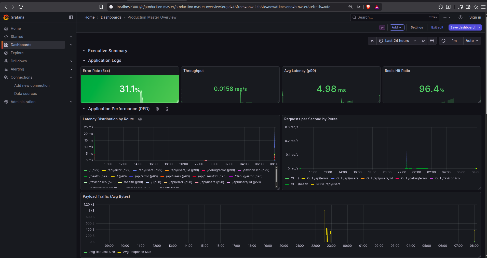
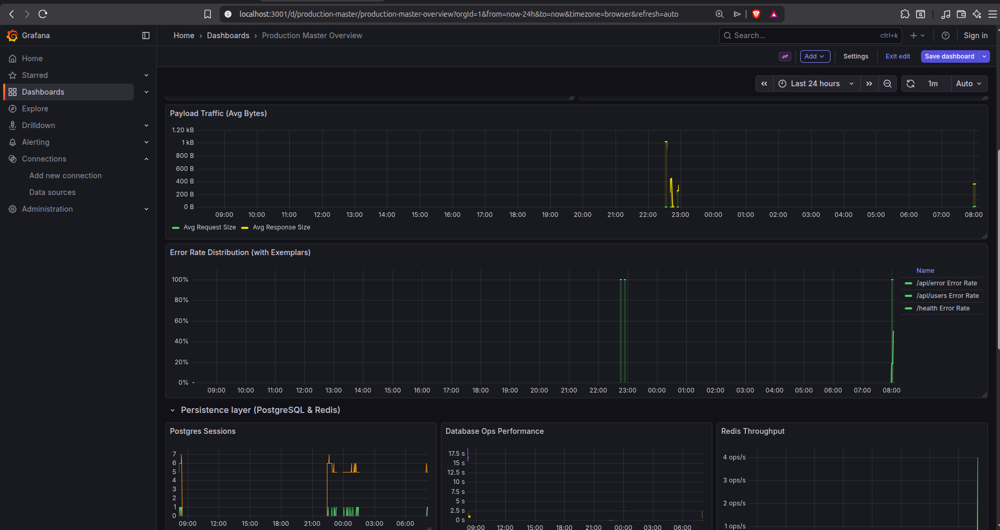
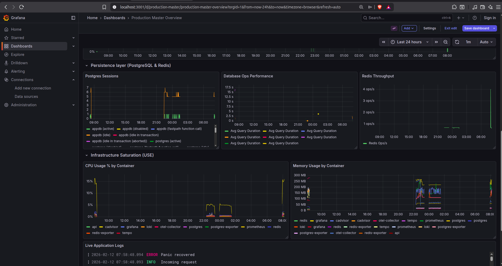

# Go Fiber OpenTelemetry Observability

Production-grade OpenTelemetry logging instrumentation for Go Fiber applications with OTLP gRPC export to Grafana Loki via OpenTelemetry Collector.

## 📊 Dashboard Preview


_Master Overview Dashboard: Monitoring the entire stack including App, DB, and Infrastructure._

|                Logs & Metrics                |                Distributed Tracing                 |
| :------------------------------------------: | :------------------------------------------------: |
|      |         |
| _Real-time log aggregation and correlation._ | _Deep-dive tracing showing SQL query performance._ |

## 🏗️ Architecture

```
Go Fiber App → OTLP gRPC (4317) → OTEL Collector → OTLP HTTP → Loki → Grafana
```

**Components:**

- **Go Fiber Application**: Instrumented with OpenTelemetry SDK for structured logging
- **OpenTelemetry Collector**: Receives logs via OTLP gRPC, processes, and exports to Loki
- **Grafana Loki**: Log aggregation with native OTLP support (v3.0+)
- **Grafana**: Visualization and querying interface

## 🚀 Quick Start

### Prerequisites

- Go 1.25+
- Docker & Docker Compose

### 1. Start Infrastructure

```bash
# Start OTEL Collector, Loki, and Grafana
docker-compose up -d

# Verify services are running
docker-compose ps
```

### 2. Run Application

```bash
# Run the Go Fiber application
go run main.go
```

The application will start on `http://localhost:3000` and automatically send logs to the OTEL Collector.

### 3. View Logs in Grafana

1. Open Grafana: `http://localhost:3001`
2. Navigate to **Explore**
3. Select **Loki** datasource
4. Query examples:

   ```logql
   # All logs from the service
   {service_name="gofiberobservability"}

   # Filter by HTTP method
   {service_name="gofiberobservability"} | json | http_method="GET"

   # Filter by status code
   {service_name="gofiberobservability"} | json | http_status_code >= 400

   # Search by trace ID
   {service_name="gofiberobservability"} | json | trace_id="<trace-id>"
   ```

## 📝 Sample Endpoints

Test the logging instrumentation with these endpoints:

```bash
# Success - 200 OK
curl http://localhost:3000/

# API endpoint - 200 OK
curl http://localhost:3000/api/users

# POST request - 201 Created
curl -X POST http://localhost:3000/api/users \
  -H "Content-Type: application/json" \
  -d '{"name":"John Doe","email":"john@example.com"}'

# Error scenario - 500 Internal Server Error
curl http://localhost:3000/api/error

# Panic recovery - 500 Internal Server Error
curl http://localhost:3000/api/panic
```

## ⚙️ Configuration

### Environment Variables

Configure the application via environment variables:

```bash
# Service metadata
export OTEL_SERVICE_NAME="gofiberobservability"
export OTEL_SERVICE_VERSION="1.0.0"
export OTEL_ENVIRONMENT="development"

# OTLP endpoint
export OTEL_EXPORTER_OTLP_ENDPOINT="localhost:4317"
export OTEL_EXPORTER_OTLP_INSECURE="true"

# Batch processor
export OTEL_BATCH_TIMEOUT="10s"
export OTEL_BATCH_MAX_QUEUE_SIZE="2048"
export OTEL_BATCH_EXPORT_TIMEOUT="30s"
```

### Log Structure

Logs are structured with OpenTelemetry semantic conventions:

```json
{
  "timestamp": "2026-02-10T06:46:09Z",
  "severity": "INFO",
  "body": "Request completed",
  "attributes": {
    "http.method": "GET",
    "http.route": "/api/users",
    "http.path": "/api/users",
    "http.status_code": 200,
    "http.request.duration_ms": 45,
    "http.response.body_size": 156,
    "http.user_agent": "curl/7.81.0",
    "http.client_ip": "127.0.0.1",
    "trace_id": "4bf92f3577b34da6a3ce929d0e0e4736",
    "span_id": "00f067aa0ba902b7"
  },
  "resource": {
    "service.name": "gofiberobservability",
    "service.version": "1.0.0",
    "deployment.environment": "development",
    "host.name": "hostname",
    "os.type": "linux"
  }
}
```

## 🔍 Features

### ✅ Implemented

- **Structured Logging**: JSON-formatted logs with OpenTelemetry semantic conventions
- **OTLP gRPC Export**: High-performance binary protocol for log export
- **Batch Processing**: Efficient batching for production workloads
- **Trace Correlation**: Automatic trace_id and span_id injection
- **Request/Response Logging**: Comprehensive HTTP request details
- **Error Handling**: Structured error logging with context
- **Panic Recovery**: Graceful panic recovery with logging
- **Graceful Shutdown**: Ensures all logs are flushed on exit
- **Resource Attributes**: Service metadata for proper identification
- **Memory Limiting**: OTEL Collector memory protection

## 📦 Project Structure

```
.
├── main.go                          # Application entry point
├── pkg/
│   ├── config/
│   │   └── config.go               # Configuration management
│   ├── logger/
│   │   └── logger.go               # OpenTelemetry logger setup
│   └── middleware/
│       └── logging.go              # Fiber logging middleware
├── docker-compose.yml              # Infrastructure stack
├── otel-collector-config.yaml      # OTEL Collector configuration
├── loki-config.yaml                # Loki configuration
├── grafana-datasources.yaml        # Grafana datasource provisioning
└── README.md                       # This file
```

## 🛠️ Development

### Building

```bash
go build -o gofiberobservability
```

### Testing

```bash
# Run tests
go test ./...

# Run with verbose output
go test -v ./...
```

### Stopping Infrastructure

```bash
# Stop services
docker-compose down

# Stop and remove volumes
docker-compose down -v
```

## 🚀 Production Deployment

### Security Considerations

1. **Enable TLS for OTLP**:

   ```go
   // In pkg/logger/logger.go
   grpcOptions = append(grpcOptions, grpc.WithTransportCredentials(credentials.NewTLS(&tls.Config{})))
   ```

2. **Configure Authentication**: Add authentication to OTEL Collector and Loki

3. **Network Security**: Use private networks, firewall rules

4. **Resource Limits**: Set appropriate memory/CPU limits in production

### Performance Tuning

1. **Batch Size**: Adjust based on log volume

   ```yaml
   # otel-collector-config.yaml
   batch:
     timeout: 5s
     send_batch_size: 5000
   ```

2. **Memory Limits**: Scale based on traffic

   ```yaml
   memory_limiter:
     limit_mib: 2048
     spike_limit_mib: 512
   ```

3. **Retention**: Configure Loki retention based on requirements
   ```yaml
   # loki-config.yaml
   limits_config:
     retention_period: 2160h # 90 days
   ```

## 📊 Monitoring

### OTEL Collector Health

```bash
# Health check
curl http://localhost:13133/

# Metrics
curl http://localhost:8888/metrics
```

### Loki Health

```bash
# Ready check
curl http://localhost:3100/ready

# Metrics
curl http://localhost:3100/metrics
```

## 🐛 Troubleshooting

### Logs not appearing in Loki

1. Check OTEL Collector logs:

   ```bash
   docker logs otel-collector
   ```

2. Verify OTLP endpoint connectivity:

   ```bash
   telnet localhost 4317
   ```

3. Check Loki logs:
   ```bash
   docker logs loki
   ```

### High memory usage

1. Reduce batch size in OTEL Collector
2. Increase memory limit
3. Check for log volume spikes

## 📚 Next Steps

- **Metrics**: Add OpenTelemetry metrics instrumentation
- **Traces**: Implement distributed tracing with Tempo
- **Alerts**: Configure alerting rules in Loki
- **Dashboards**: Create Grafana dashboards for monitoring

## 📖 References

- [OpenTelemetry Go Documentation](https://opentelemetry.io/docs/languages/go/)
- [Grafana Loki Documentation](https://grafana.com/docs/loki/latest/)
- [OTEL Collector Documentation](https://opentelemetry.io/docs/collector/)
- [Go Fiber Documentation](https://docs.gofiber.io/)

## 📄 License

MIT License
